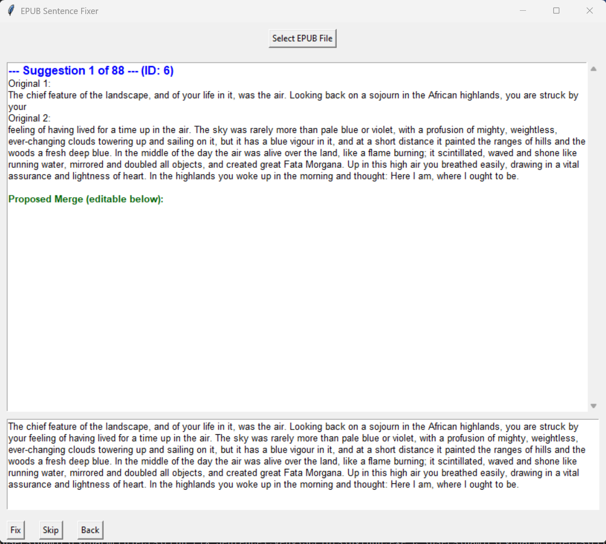

Allows you to easily fix broken sentences caused by PDF-to-EPUB conversions, directly inside the EPUB file.

A common issue when converting books from PDF is that sentences are split in half, with the second part placed on 
a new line as a separate paragraph.

The software automatically detects such issues and presents them to you, 
allowing you to review and choose which ones to fix.

Original file is preserved. Software will log all changes and save log file.

### Example:
Broken
```
This is an example of a broken sentence that was split
into two separate paragraphs during conversion.
```
Fixed
```
This is an example of a broken sentence that was split into two separate paragraphs during conversion.
Requirements
```

```pip install -r requirements```

<p style="text-align: left;">
  
</p>

Here in this example it found 88 broken sentences. 

**Original 1:** shows first part of the sentence 

**Original 2:** shows second part of the sentence in a new paragraph

Below in a preview window you can preview how it will look when fixed and decide to accept the change or skip it.